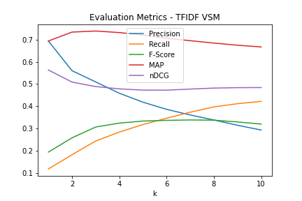
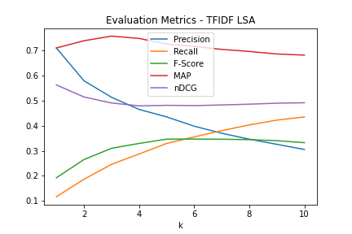
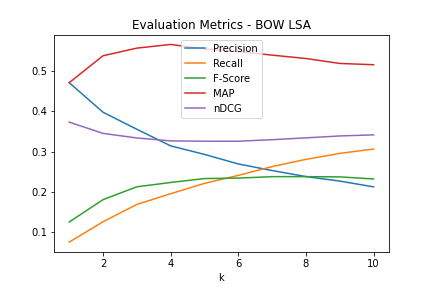
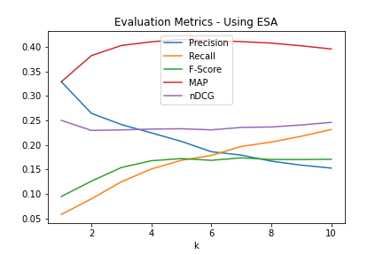
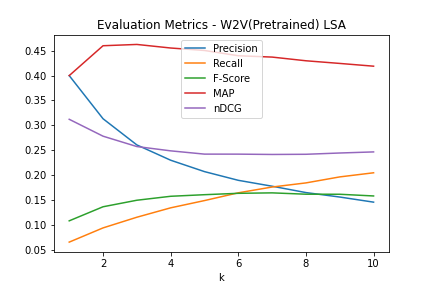

# NLP Project: Advanced Information Retrieval System

This repository implements an efficient, semantically-aware IR engine built for CS6370-NLP course at IIT Madras. Starting from a TF–IDF Vector Space Model (VSM) on the Cranfield collection, we layer in advanced NLP techniques—custom preprocessing, Latent Semantic Analysis (LSA), Explicit Semantic Analysis (ESA), and Word2Vec embeddings—to bridge keyword gaps and retrieve more relevant documents. A unified evaluation suite (Precision@k, Recall@k, F1@k, MAP@k, nDCG@k for k = 1…10) tracks performance across variants.

## Motivation

Traditional keyword search struggles with synonymy (“automobile” vs. “car”) and polysemy (“bank”). By incorporating semantic models, this project aims to:
- **Broaden Recall** through concept-level matching  
- **Sharpen Precision** by reducing noise from irrelevant senses  
- **Compare Approaches** (VSM, LSA, ESA, W2V) under a single evaluation framework  

## Features

1. **Modular Preprocessing**  
   - Sentence split: naive or NLTK Punkt  
   - Tokenization: naive or Penn Treebank  
   - Lemmatization: NLTK WordNet  
   - Stopword filtering (NLTK list)  
   - VSM-2 extras: lowercasing, numeric/punctuation stripping  

2. **Vector Space Model (VSM)**  
   - TF–IDF weighting via scikit-learn  
   - Cosine similarity ranking  
   - Two pipelines (VSM-1 vs. enhanced VSM-2)  

3. **Latent Semantic Analysis (LSA)**  
   - Truncated SVD on TF–IDF or BoW matrices  
   - Captures hidden term–document relationships  

4. **ESA & Word2Vec (Experimental)**  
   - ESA concept vectors (`main_ESA.py`)  
   - Word2Vec retrieval (`main_W2v.py`, `main_newW2V.py`)  

5. **Evaluation Suite**  
   - Metrics: Precision, Recall, F1, MAP, nDCG @ k=1–10  
   - Automated plotting and Cranfield qrels integration  


## Dataset

The system is designed and evaluated using the **Cranfield collection**, a standard test collection for IR research. It includes:
*   `cran_docs.json`: 1400 documents (abstracts of aerodynamics papers).
*   `cran_queries.json`: 225 queries.
*   `cran_qrels.json`: Relevance judgments indicating which documents are relevant to which queries.

## Code Structure

The repository is organized as follows:

```
├── cranfield/                  # Cranfield dataset files (docs, queries, qrels)
├── output/                     # Default directory for preprocessed files and evaluation plots
├── ESAFunctions.py             # Functions potentially related to ESA implementation
├── README.md                   # This file (will be replaced by this new version)
├── evaluation.py               # Implementation of IR evaluation metrics
├── hyperparameterTuning.py     # Script likely used for LSA hyperparameter tuning (e.g., num_components)
├── inflectionReduction.py      # Lemmatization implementation
├── informationRetrieval.py     # Core VSM (TF-IDF) implementation
├── informationRetrievalLSA.py  # Core LSA implementation (using TF-IDF or BoW)
├── informationRetrievalNewW2V.py # Potential alternative Word2Vec IR implementation
├── informationRetrievalW2V.py  # Potential Word2Vec IR implementation
├── main.py                     # Main script for running VSM (TF-IDF) model and evaluation
├── main_ESA.py                 # Main script likely for running ESA model
├── main_LSA_skl.py             # Main script for running LSA model (using scikit-learn)
├── main_W2v.py                 # Main script likely for running Word2Vec model
├── main_newW2V.py              # Main script likely for running alternative Word2Vec model
├── sentenceSegmentation.py     # Sentence segmentation implementation
├── stopwordRemoval.py          # Stopword removal implementation
├── tokenization.py             # Tokenization implementation
├── util.py                     # Utility functions (potentially shared across modules)
```

## Setup and Usage

### Prerequisites

*   Python 3.x
*   Required Python packages (install via pip):
    *   `nltk`
    *   `scikit-learn`
    *   `numpy`
    *   `matplotlib`

    ```bash
    pip install nltk scikit-learn numpy matplotlib
    ```
*   NLTK data (download required resources):
    ```python
    import nltk
    nltk.download('punkt')
    nltk.download('wordnet')
    nltk.download('stopwords')
    ```

### Running the System

The system can be run using the various `main_*.py` scripts. The primary script for the baseline VSM is `main.py`.

**1. Evaluate VSM (TF-IDF) on Cranfield Dataset:**

```bash
python main.py -dataset cranfield/ -out_folder output/
```

This command will:
*   Preprocess the Cranfield documents and queries using default settings (Punkt sentence segmenter, Penn Treebank tokenizer, Lemmatization, Stopword removal).
*   Build a TF-IDF based VSM index.
*   Rank documents for all queries.
*   Evaluate the results using Precision, Recall, F-score, MAP, and nDCG (for k=1 to 10).
*   Save preprocessed files and an evaluation plot (`eval_plot_tfidf_vsm.png`) to the `output/` directory.

**2. Evaluate LSA on Cranfield Dataset:**

Use `main_LSA_skl.py`. You might need to adjust parameters like the number of components (`num_components`) or the vectorizer (`vectorizer='tfidf'` or `vectorizer='bow'`) within the script or via command-line arguments if available (check the script's argument parser).

```bash
# Example (assuming default parameters in the script are suitable)
python main_LSA_skl.py -dataset cranfield/ -out_folder output/
```

**3. Evaluate ESA / Word2Vec Models:**

Run the corresponding `main_ESA.py`, `main_W2v.py`, or `main_newW2V.py` scripts. Examine these scripts for specific parameters or setup requirements.

```bash
# Example (syntax might vary based on script implementation)
python main_ESA.py -dataset cranfield/ -out_folder output/
python main_W2v.py -dataset cranfield/ -out_folder output/
```

**4. Handle a Custom Query (using VSM):**

```bash
python main.py -dataset cranfield/ -out_folder output/ -custom
```

The script will prompt you to enter a query, preprocess it, rank documents from the Cranfield dataset using the VSM-TFIDF model, and display the top 5 relevant document IDs.

**5. Customization:**

*   **Preprocessing:** You can change the segmenter and tokenizer via command-line arguments in `main.py`:
    ```bash
    python main.py -segmenter naive -tokenizer naive ...
    ```
*   **Output Folder:** Specify a different output directory using `-out_folder`.
*   **LSA Parameters:** Modify `num_components` and `vectorizer` directly within `informationRetrievalLSA.py` or `main_LSA_skl.py` if command-line arguments are not implemented for these.

## Evaluation Results Summary

Detailed evaluation results comparing **VSM-1**, **VSM-2**, and other models such as **LSA**, **ESA**, and **Word2Vec (W2V)** can be found in the accompanying [**NLP\_FINAL\_REPORT.pdf**](https://github.com/ahmecse/CS6370-NLP-IR-System-Project-IITM/blob/main/NLP_FINAL_REPORT.pdf).
Refer to the [**`output/` folder**](https://github.com/ahmecse/CS6370-NLP-IR-System-Project-IITM/tree/main/output) for generated plots and visual comparisons.

Below are the key evaluation plots stored in the `output/` directory. 

| Plot                                 | Description                                                                                                                                                                                                                                                                                      |
| ------------------------------------ | ------------------------------------------------------------------------------------------------------------------------------------------------------------------------------------------------------------------------------------------------------------------------------------------------ |
| **TF–IDF VSM Comparison**            | <br>Compares Precision\@k, Recall\@k, F1\@k, MAP\@k, and nDCG\@k for k = 1…10 between VSM‑1 (baseline) and VSM‑2 (enhanced preprocessing). VSM‑2 consistently outperforms VSM‑1, with up to a 5% gain in MAP at k = 5 and higher F1 at low k. |
| **LSA with TF–IDF Input**            | <br>Shows LSA (100 components) on the TF–IDF matrix. Gains in MAP and nDCG at k = 3–7 by capturing latent semantics, but a slight drop in Precision\@1 due to term generalization.                                                            |
| **LSA with Bag‑of‑Words Input**      | <br>Similar trends to TF–IDF LSA, but marginally lower MAP, indicating TF–IDF weighting aids semantic reduction more than raw counts.                                                                                                              |
| **Explicit Semantic Analysis (ESA)** | <br>ESA boosts Recall\@k across all k, leveraging concept vectors; however, Precision\@1–2 dips because of noisy concept associations.                                                                                                                     |
| **Word2Vec Embedding Retrieval**     | )<br>Word2Vec achieves the highest nDCG\@10, demonstrating robust ranking for larger result sets. Precision\@1 is on par with VSM‑2, highlighting embeddings’ effectiveness for top‑ranked documents.                                                  |
| **Final Results Comparison**         | <br>Aggregated comparison of MAP\@5 across all models, indicating Word2Vec > LSA (TF–IDF) > ESA > VSM‑2 > LSA (BoW) > VSM‑1.                                                                                                                       |


### Limitations & Future Work

* **Scalability:** Optimize indexing for larger corpora (inverted indices, parallelization).
* **Query Expansion:** Incorporate thesauri, pseudo-relevance feedback.
* **Transformer Models:** Experiment with BERT-based retrieval.
* **Topic Modeling:** Cluster documents (LDA, K-Means) to refine search space.
* **UX Enhancements:** Auto-completion, interactive search UI.
* **Hyperparameter Search:** Automated tuning (grid/random search).

---

### Keywords

Information Retrieval, NLP, VSM, TF–IDF, LSA, ESA, Word2Vec, Precision, Recall, MAP, nDCG, Cranfield

---

### References

1. Salton, G., Wong, A., & Yang, C.-S. (1975). A vector space model for automatic indexing. *Communications of the ACM*, 18(11), 613–620.
2. Manning, C. D., Raghavan, P., & Schütze, H. (2008). *Introduction to Information Retrieval*. Cambridge University Press.
3. Deerwester, S. T., Dumais, T. K., Furnas, G. W., Landauer, T. K., & Harshman, R. (1990). Indexing by latent semantic analysis. *Journal of the American Society for Information Science*, 41(6), 391–407.
4. Azad, H. K., & Deepak, A. (2019). Query expansion techniques for information retrieval: A survey. *Information Processing & Management*, 56(5), 1698–1735.

